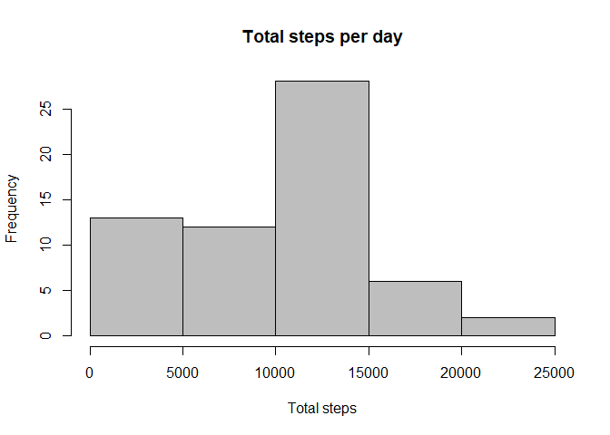
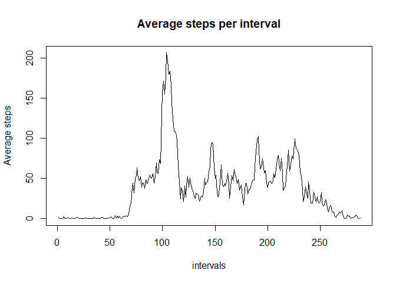
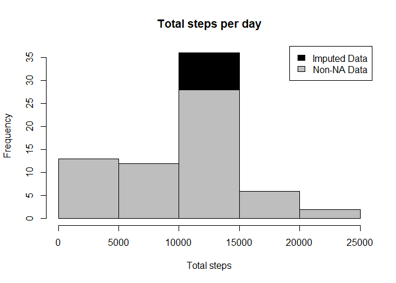
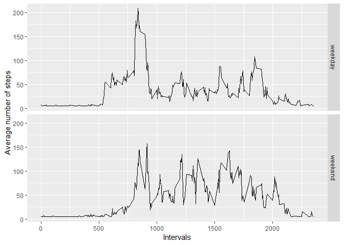

Loading and processing the data
-------------------------------

    data <- read.csv("activity.csv")
    data$date <- as.Date(data$date)

What is the mean total number of steps taken per day?
-----------------------------------------------------

To show the total number of steps per day in a histogram, the sum of all
steps per day is calculated for each day.

    sum_steps <- with(data,tapply(steps,date,sum,na.rm=TRUE))

 From the
sum of all steps per day, we can easily calculate the mean and nedian
steps per day.

    print(mean_steps <- mean(sum_steps))

    ## [1] 9354.23

    print(median_steps <- median(sum_steps))

    ## [1] 10395

What is the average daily activity pattern?
-------------------------------------------

For this task we need to calculate the averager steps per interval.

    avg_steps <- with(data, tapply(steps,interval,mean,na.rm=TRUE))

This result shows the interval with the most steps on average and the
average steps taken in this interval:

    print(avg_steps[which.max(avg_steps)])

    ##      835 
    ## 206.1698

Imputing missing values
-----------------------

The amount of missing values is a calculation of all rows from this data
set subtracted by all complete cases.

    print(nrow(data) - sum(complete.cases(data)))

    ## [1] 2304

Now we insert all the missing values with the mean value of that
interval over all days.

    data_avg <- data
    data_avg[is.na(data_avg$steps),]$steps <- mean(data_avg$steps,interval = data_avg$interval, na.rm=TRUE)

    sum_steps_avg <- with(data_avg,tapply(steps,date,sum,na.rm=TRUE))

And this compares the total amount of steps per interval with imputed
values and with removed NAs. Imputed NAs lead to more total steps.

    hist(sum_steps_avg, xlab = "Total steps", main = "Total steps per day", col="black")
    hist(sum_steps, xlab = "Total steps", main = "Total steps per day", col="grey",add=T)
    legend("topright", c("Imputed Data", "Non-NA Data"), fill=c("black", "grey") )

 And
again from the steps with imputed values we can easily calculate the
mean and median amount of steps per interval. They are now the same
instead of very close.

    print(mean_steps_avg <- mean(sum_steps_avg))

    ## [1] 10766.19

    print(median_steps_avg <- median(sum_steps_avg))

    ## [1] 10766.19

Are there differences in activity patterns between weekdays and weekends?
-------------------------------------------------------------------------

Before we can ploit, we need to divide the data into weekday data and
weekend data.

    weekday.or.weekend <- function(date) {
        day <- weekdays(date)
        if (day %in% c("Montag", "Dienstag", "Mittwoch", "Donnerstag", "Freitag"))
            return("weekday")
        else if (day %in% c("Samstag", "Sonntag"))
            return("weekend")
        else
            stop("invalid date")
    }
    data_avg$date <- as.Date(data_avg$date)
    data_avg$day <- sapply(data_avg$date, FUN=weekday.or.weekend)

With this plot we show the difference in the step patterns between
weekdays and weekends.

    averages <- aggregate(steps ~ interval + day, data=data_avg, mean)
    ggplot(averages, aes(interval, steps)) + geom_line() + facet_grid(day ~ .) +
        xlab("Intervals") + ylab("Average number of steps")

